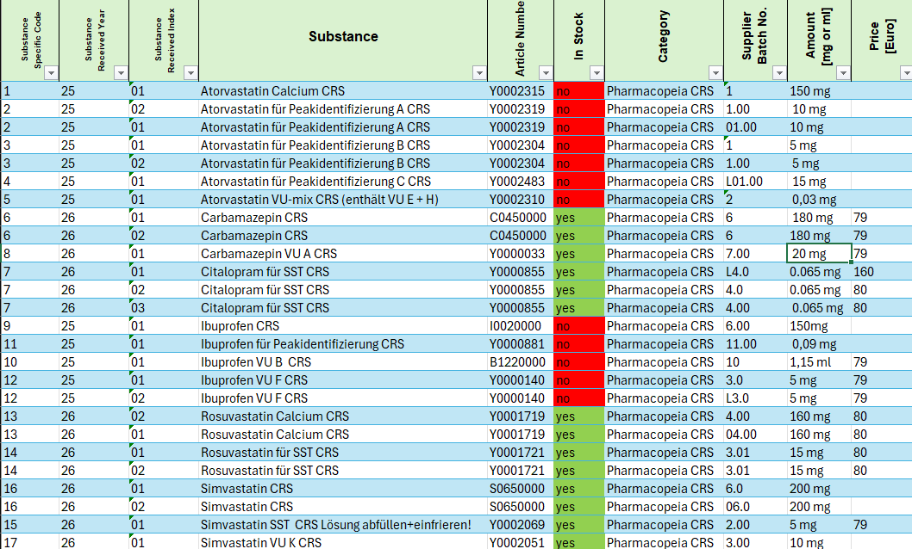
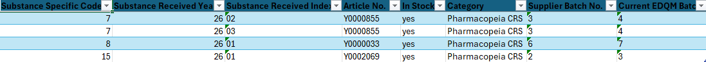

# Reference Batch Check

Automates comparison between internal EDQM and USP reference standard inventory
and current EDQM and USP catalogue batch information.

## Features

- Download current EDQM XML catalogue
- Download the current USP CSV catalogue
- Compare local inventory batches with current batches
- Detect potentially outdated standards
- Generate formatted Excel report worksheets
- Standalone executable support

### Input Workbook


### Generated EDQM Check


## Program Workflow

1. Load inventory workbook
2. Download EDQM XML catalogue
3. Download USP CSV catalogue
4. Compare batch numbers
5. Create a new Excel worksheet containing discrepancies

## Tech Stack

- Python
- pandas
- openpyxl
- requests

## Workbook Structure

The current implementation is tailored to a specific Excel workbook layout.

Column indices and row offsets are hardcoded in `create_df()` and may need
to be adjusted for other workbook formats.

Example:

```python
batch_number_company = [
    ws.cell(row=i, column=54).value
    for i in range(5, ws.max_row + 1)
]
```

Users adapting the tool to different inventory workbooks should update
the corresponding column mappings in `main.py`.

## Configuration

Adjust the input workbook path, EDQM XML destination path
and worksheet name in `main.py` according to the local file structure.

Example:

```python
patt_edqm = Path(r"\\network_drive\QC\ReferenceSubstances.xlsx")
path_usp = Path(r"C:\Temp\web_catalog_XML.xml")
```

## Installation

Install dependencies:

```bash
pip install -r requirements.txt
```

Run the application:

```bash
python main.py
```

## Executable Build

A standalone executable can be created using PyInstaller:

```bash
pip install pyinstaller
pyinstaller --onefile --name EDQM_comparison main.py
```

## Disclaimer

This tool only compares current EDQM and USP batches and does not evaluate
official Batch Validity Statements (BVS).